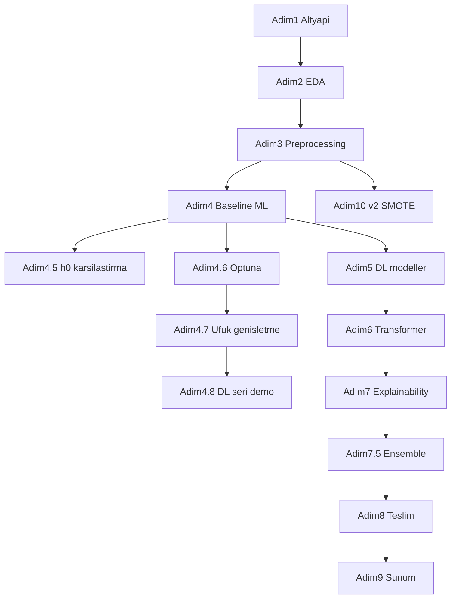

# Sepsis AI — Tez Sunum ve Kod Gösterim Rehberi

> **Oluşturulma:** 2026-06-03  
> **Kapsam:** `sepsis-son/adim_1` – `adim_10` (+ ara adımlar 4.5, 4.6, 4.7, 4.8, 7.5)  
> **Amaç:** Tez savunması ve kod gösterimi sırasında her adımda ne anlatılacağını ve ilgili fonksiyonların ne yaptığını tek referans belgede toplamak.

---

## Genel Proje Akışı

---

## İçindekiler

1. [Adım 1 — Kapsam, Altyapı, Literatür](#adım-1--kapsam-altyapı-literatür-2026-05-07)
2. [Adım 2 — EDA](#adım-2--eda-2026-05-07)
3. [Adım 3 — Preprocessing](#adım-3--preprocessing-2026-05-07)
4. [Adım 4 — Baseline ML (h=6)](#adım-4--baseline-ml-h6-2026-05-07)
5. [Adım 4.5 — h=0 Mevcut Tespit Karşılaştırması](#adım-45--h0-mevcut-tespit-karşılaştırması-2026-05-07)
6. [Adım 4.6 — Optuna h=6 İyileştirmesi](#adım-46--optuna-h6-iyileştirmesi-2026-05-20)
7. [Adım 4.7 — Ufuk Genişletme (h=0 + h=24)](#adım-47--ufuk-genişletme-h0--h24-2026-05-23)
8. [Adım 4.8 — Gerçek Saatlik Seri DL Demo](#adım-48--gerçek-saatlik-seri-dl-demo-2026-05-23)
9. [Adım 5 — Derin Öğrenme (LSTM/GRU/BiGRU)](#adım-5--derin-öğrenme-lstmgrubigru-2026-05-08)
10. [Adım 6 — Transformer + 9 Model Karşılaştırması](#adım-6--transformer--9-model-karşılaştırması-2026-05-09)
11. [Adım 7 — Açıklanabilirlik (SHAP/LIME/Attention)](#adım-7--açıklanabilirlik-shaplimeattention-2026-05-09)
12. [Adım 7.5 — Eşik / Özellik / Ensemble İyileştirme](#adım-75--eşik--özellik--ensemble-i̇yileştirme-2026-05-10)
13. [Adım 8 — Teslim Altyapısı](#adım-8--teslim-altyapısı-2026-05-10)
14. [Adım 9 — Sunum/Demo Hazırlığı](#adım-9--sunumdemo-hazırlığı-2026-05-19)
15. [Adım 10 — v2 Preprocessing + SMOTE ML](#adım-10--v2-preprocessing--smote-ml-2026-05-23)
16. [Sunum İpuçları](#sunum-i̇puçları)

---

## Adım 1 — Kapsam, Altyapı, Literatür (2026-05-07)

**Klasör:** `sepsis-son/adim_1_2026-05-07/`  
**Rapor:** [`rapor.md`](../../sepsis-son/adim_1_2026-05-07/rapor.md)

### Sunumda anlatılacak konular

1. Proje amacı: sepsis erken uyarı sistemi + açıklanabilirlik pipeline'ı; bu faz tez Bölüm 1 (Giriş) ve Bölüm 2 (Literatür) kaynağı oluşturur.
2. Sabitlenen parametreler: `horizon=6`, `window=24`, `stride=6`, 18 feature — sonraki tüm fazlarda değişmez (`AGENTS.md`).
3. Ortam doğrulaması: Python 3.12.4, 10/10 paket OK, 3/3 veri yolu OK, backend `/health` → HTTP 200.
4. Reuse envanteri: 14 varlık tarandı (6× `al-degistir-kullan`, 8× `incelenecek`); hazır `.pkl` dosyaları provenance doğrulanmadan kullanılmaz.
5. Literatür özeti: 5 anahtar makale + research gap — 9 model karşılaştırması ve canlı explainability pipeline boşluğu.
6. Ham PSV indirme Faz 2'ye ertelendi; bu fazda envanter ve literatür ile ölçeklenebilir başlangıç sağlandı.
7. Gantt çizelgesi: 9 faz, toplam ~29 günlük proje planı (`grafik_diagramlar/gantt_zaman_cizelgesi.png`).
8. Tez akış şeması ve mimari genel diyagramları üretildi (`tez_akis_semasi.png`, `mimari_genel.png`).

### Kod dosyaları ve fonksiyonlar

#### `kod/verify_setup.py`

| Fonksiyon | Ne yapar? |
|-----------|-----------|
| `verify_python_version` | Python sürümünün minimum gereksinimi (≥3.10) karşılayıp karşılamadığını kontrol eder. |
| `verify_packages` | Gerekli 10 paketin kurulu olup olmadığını import ile doğrular. |
| `verify_data_paths` | Referans veri/model yollarının varlığını ve dosya boyutunu kontrol eder. |
| `verify_api_health` | Backend `/health` endpoint'inin HTTP 200 dönüp dönmediğini test eder. |
| `main` | Tüm kontrolleri birleştirip `setup_check.json` çıktısını yazar. |
| `_parse_args` | CLI argümanlarını çözümler. |

#### `kod/scan_reuse_assets.py`

| Fonksiyon | Ne yapar? |
|-----------|-----------|
| `_short_sha1` | Dosya için kısa SHA1 hash (12 karakter) üretir. |
| `scan_targets` | 14 hedef varlığı tarayıp envanter kayıtları oluşturur. |
| `summarize` | Karar dağılımı (`al-degistir-kullan` / `incelenecek`) özetini hesaplar. |
| `main` | Envanteri JSON olarak kaydeder. |
| `_parse_args` | CLI argümanlarını çözümler. |

#### `kod/draw_gantt.py`

| Fonksiyon | Ne yapar? |
|-----------|-----------|
| `_apply_rcparams` | Tez standardına uygun matplotlib ayarlarını uygular. |
| `build_gantt` | 9 fazlık Gantt benzeri PNG grafiği üretir. |
| `_parse_args` | CLI argümanlarını çözümler. |

---

## Adım 2 — EDA (2026-05-07)

**Klasör:** `sepsis-son/adim_2_2026-05-07/`  
**Rapor:** [`rapor.md`](../../sepsis-son/adim_2_2026-05-07/rapor.md)

### Sunumda anlatılacak konular

1. Veri boyutu: 40.336 hasta, 1.552.210 satır (PhysioNet 2019 Challenge setA + setB).
2. Sepsis dengesizliği: hasta bazında %7,27 sepsis; satır bazında pozitif oran yalnızca %1,80 — sınıf dengesizliği vurgusu.
3. Zaman serisi profili: medyan 38 saat (IQR 24–47); sepsis onset medyan ICU girişinden +29 saat sonra.
4. Eksik veri: 27 feature >%80 missing; en yüksek `Bilirubin_direct` %99,8 eksik.
5. 6 EDA grafiği üretildi: missing heatmap/bar, uzunluk dağılımı, label balance, vital/lab boxplot.
6. Faz 3 kararları: >%80 missing sütun eleme, log1p adayları, ffill→median imputation, `set_label` modele girmeyecek.
7. EDA çıktıları JSON + PNG olarak donduruldu; preprocessing tamamen veri-temelli karar aldı.

### Kod dosyaları ve fonksiyonlar

#### `kod/run_eda.py`

| Fonksiyon | Ne yapar? |
|-----------|-----------|
| `load_psv_set` | PSV dosyalarını yükler, `Patient_ID` ve `set_label` sütunlarını ekler. |
| `categorize_features` | Sütunları vital/lab/demografi/klinik/meta kategorilerine ayırır. |
| `analyze_missing` | Feature bazında eksik veri oranlarını hesaplar. |
| `analyze_lengths` | Hasta başına zaman serisi uzunluk istatistiklerini çıkarır. |
| `analyze_label` | Sepsis etiket dengesi ve onset saatini analiz eder. |
| `make_figures` | 6 standart EDA PNG grafiği üretir. |
| `main` | Tam EDA boru hattını çalıştırır ve JSON/PNG çıktıları yazar. |

---

## Adım 3 — Preprocessing (2026-05-07)

**Klasör:** `sepsis-son/adim_3_2026-05-07/`  
**Rapor:** [`rapor.md`](../../sepsis-son/adim_3_2026-05-07/rapor.md)

### Sunumda anlatılacak konular

1. 8 adımlı pipeline: birleştirme → sütun eleme → imputation → log1p → scaling → horizon label → split → sliding window.
2. Hasta bazlı stratified split: 28.234 / 6.051 / 6.051 hasta; her split'te sepsis oranı %7,27 (data leakage yok).
3. 18 feature (13 numerik scaled + 5 demografik); `HorizonLabel` pozitif oranı %2,71.
4. 94.535 sliding window (W=24, stride=6) train setinde; kısa hastalar zero-pad ile tamamlanır.
5. `splits.json` frozen — Faz 4–7 boyunca değiştirilmez; tüm model karşılaştırmaları aynı split üzerinde.
6. `feature_stats.json` ile StandardScaler istatistikleri kaydedildi; inference'da aynı scaler kullanılır.
7. 4 preprocessing grafiği: dağılım histogramları ve split görselleştirmesi.

### Kod dosyaları ve fonksiyonlar

#### `kod/run_preprocessing.py`

| Fonksiyon | Ne yapar? |
|-----------|-----------|
| `load_and_merge` | setA ve setB PSV dosyalarını birleştirip tek DataFrame oluşturur. |
| `_load_set` (iç) | Tek set klasöründen PSV dosyalarını yükler. |
| `preprocess` | Sütun eleme, ffill/bfill, log1p, StandardScaler ve gender one-hot uygular. |
| `create_horizon_labels` | Belirtilen ufuk (h saat) için `HorizonLabel` üretir. |
| `patient_based_split` | Hasta bazlı stratified train/val/test böler. |
| `_split` (iç) | PID listesini train/val/test oranlarına göre ayırır. |
| `_sepsis_rate` (iç) | Verilen hasta listesinde sepsis oranını hesaplar. |
| `build_windows` | Sliding window tensor (N×24×18) üretir, kısa hastaları zero-pad eder. |
| `_histogram_input_array` | Histogram için 1D float64 dizi hazırlar. |
| `_histogram_uniform_counts_edges` | NumPy uyumluluğu için güvenli bin sayımı yapar. |
| `_draw_histogram_bins` | `Axes.hist` yerine bar ile histogram çizer. |
| `make_figures` | 4 preprocessing PNG (dağılım + split) üretir. |
| `main` | Tam 8 adımlı pipeline'ı çalıştırır ve tüm çıktıları yazar. |

---

## Adım 4 — Baseline ML (h=6) (2026-05-07)

**Klasör:** `sepsis-son/adim_4_2026-05-07/`  
**Rapor:** [`rapor.md`](../../sepsis-son/adim_4_2026-05-07/rapor.md)

### Sunumda anlatılacak konular

1. 5 klasik ML modeli: LR, RF, XGB, GB, NB; hedef `HorizonLabel` h=6 (6 saat erken uyarı).
2. En iyi AUROC: XGBoost 0.8220; en yüksek Sens@Spec=0.85: Gradient Boosting 0.6238.
3. Lead-time medyan 29,5–33,5 saat — sepsis öncesi klinik erken uyarı penceresi.
4. Değerlendirme protokolü: Spec=0.85 sabit eşik; AUROC, AUPRC, Brier, confusion matrix.
5. Gerçek `.pkl` modeller backend `/predict/snapshot` endpoint'ine bağlandı (hazır model reuse değil).
6. XGB grid search (3×2); RF/GB feature importance ve kalibrasyon eğrileri üretildi.
7. Referans baseline: sonraki DL, Optuna ve ensemble fazları bu rakamlarla karşılaştırılır.

### Kod dosyaları ve fonksiyonlar

#### `kod/train_5_models.py`

| Fonksiyon | Ne yapar? |
|-----------|-----------|
| `load_data` | CSV ve splits'ten h=6 train/val/test matrislerini yükler. |
| `xgb_grid_search` | XGB için 3×2 grid araması yapar. |
| `threshold_at_specificity` | Spec=0.85 eşiğini validation setinde bulur. |
| `compute_metrics` | AUROC, AUPRC, Sens, F1, Brier metriklerini hesaplar. |
| `save_roc` | ROC eğrisi PNG kaydeder. |
| `save_pr` | PR eğrisi PNG kaydeder. |
| `save_metric_bar` | Metrik bar grafiği kaydeder. |
| `save_xgb_grid_heatmap` | XGB grid arama heatmap kaydeder. |
| `save_calibration` | Kalibrasyon eğrileri PNG kaydeder. |
| `save_feature_importance` | XGB ve RF feature importance grafiği kaydeder. |
| `save_confusion_matrix` | 5 model confusion matrix PNG kaydeder. |
| `main` | 5 modeli eğitir, değerlendirir, pkl/threshold/metrik yazar. |

#### `kod/evaluate_lead_time.py`

| Fonksiyon | Ne yapar? |
|-----------|-----------|
| `threshold_at_specificity` | Spec=0.85 eşiğini bulur. |
| `compute_lead_times` | Sepsis hastalarında medyan/ortalama lead-time hesaplar. |
| `save_lead_time_bar` | Lead-time bar grafiği kaydeder. |
| `main` | 5 model için lead-time analizi çalıştırır. |

---

## Adım 4.5 — h=0 Mevcut Tespit Karşılaştırması (2026-05-07)

**Klasör:** `sepsis-son/adim_4_5_2026-05-07/`  
**Rapor:** [`rapor.md`](../../sepsis-son/adim_4_5_2026-05-07/rapor.md)

### Sunumda anlatılacak konular

1. Aynı 5 ML model `SepsisLabel` (h=0, anlık tespit) ile eğitildi — akademik karşılaştırma amaçlı, backend değişikliği yok.
2. Bulgu 1: h=0 vs h=6 AUROC farkı ±0.006'dan az (istatistiksel anlamsız).
3. Bulgu 2: SMOTE+Optuna ile RF 0.795→0.818 (+0.023); XGB 0.828→0.825 (−0.003) — sınırlı etki.
4. Bulgu 3: Harici çalışmaların yüksek AUROC (~0.958) muhtemelen satır-bazlı split kaynaklı data leakage.
5. MICE imputation etkisi sıfır (NaN=0, ffill/bfill tam impute).
6. Backend h=6 olarak kalır; h=0 backend'e bu fazda eklenmez (Faz 4.7'de değişir).
7. Üç yönlü karşılaştırma grafiği: h=6 / h=0 / h=0+SMOTE+Optuna.

### Kod dosyaları ve fonksiyonlar

#### `kod/train_current_detection.py`

| Fonksiyon | Ne yapar? |
|-----------|-----------|
| `load_data` | `SepsisLabel` hedefiyle train/val/test matrislerini yükler. |
| `threshold_at_specificity` | Spec=0.85 eşiğini bulur. |
| `compute_metrics` | AUROC, AUPRC, Sens, F1, Brier hesaplar. |
| `save_roc_h0` | h=0 ROC eğrisi PNG kaydeder. |
| `save_pr_h0` | h=0 PR eğrisi PNG kaydeder. |
| `save_metric_bar_h0` | h=0 metrik bar grafiği kaydeder. |
| `save_confusion_matrix_h0` | h=0 confusion matrix PNG kaydeder. |
| `main` | 5 modeli h=0 hedefiyle eğitir ve değerlendirir. |

#### `kod/compare_horizons.py`

| Fonksiyon | Ne yapar? |
|-----------|-----------|
| `load_metrics` | JSON metrik dosyasını yükler. |
| `plot_horizon_comparison` | h=0 vs h=6 AUROC/AUPRC grouped bar grafiği üretir. |
| `print_comparison_table` | Terminalde AUROC karşılaştırma tablosu yazdırır. |
| `plot_three_way_comparison` | h=6 / h=0 / h=0+SMOTE+Optuna 3'lü karşılaştırma grafiği üretir. |
| `main` | Metrik dosyalarını yükleyip karşılaştırma grafiklerini üretir. |

#### `kod/train_enhanced_h0.py`

| Fonksiyon | Ne yapar? |
|-----------|-----------|
| `load_data` | SepsisLabel hedefiyle veri yükler, NaN kontrolü yapar. |
| `threshold_at_specificity` | Spec=0.85 eşiğini bulur. |
| `compute_metrics` | Test metriklerini hesaplar. |
| `apply_smote` | SMOTE ile eğitim setini dengeler (sampling_strategy=0.2). |
| `optuna_xgb` | SMOTE sonrası XGB için Optuna HPO yapar. |
| `objective` (iç, XGB) | Tek Optuna trial'ında validation AUROC döndürür. |
| `optuna_rf` | SMOTE sonrası RF için Optuna HPO yapar. |
| `objective` (iç, RF) | Tek Optuna trial'ında validation AUROC döndürür. |
| `save_enhanced_bar` | Temel vs SMOTE+Optuna bar grafiği kaydeder. |
| `main` | Güçlendirilmiş h=0 eğitim boru hattını çalıştırır. |

---

## Adım 4.6 — Optuna h=6 İyileştirmesi (2026-05-20)

**Klasör:** `sepsis-son/adim_4_6_2026-05-20/`  
**Rapor:** [`rapor.md`](../../sepsis-son/adim_4_6_2026-05-20/rapor.md)

### Sunumda anlatılacak konular

1. `sepsis-early-detection` projesinden güvenli teknikler taşındı: Optuna HPO, metadata.json.
2. Bilinçli dışlananlar: SMOTEENN, h=0 protokolü, satır-bazlı CV (leakage riski).
3. RF AUROC: 0.7980 → 0.8149 (+0.0169); XGB: 0.8220 → 0.8257 (+0.0037).
4. Optuna h=6 modelleri backend snapshot'larına yazıldı; SMOTE h=6 pipeline'a eklenmedi.
5. Metodoloji benimsenen/reddedilen teknikler JSON'da belgelendi (`methodology_adoptions.json`).

### Kod dosyaları ve fonksiyonlar

#### `kod/train_optuna_h6.py`

| Fonksiyon | Ne yapar? |
|-----------|-----------|
| `load_horizon_data` | HorizonLabel (h=6) train/val/test matrislerini yükler. |
| `threshold_at_specificity` | Spec=0.85 eşiğini bulur. |
| `compute_metrics` | AUROC, AUPRC, Sens, F1, Brier hesaplar. |
| `optuna_xgb_h6` | XGB için Optuna ile validation AUROC optimizasyonu yapar. |
| `objective` (iç, XGB) | Tek trial'da XGB hiperparametrelerini eğitip val AUROC döndürür. |
| `optuna_rf_h6` | RF için Optuna ile validation AUROC optimizasyonu yapar. |
| `objective` (iç, RF) | Tek trial'da RF hiperparametrelerini eğitip val AUROC döndürür. |
| `save_model_metadata` | Model metadata JSON kaydeder. |
| `save_comparison_chart` | Faz 4 vs Optuna karşılaştırma grafiği üretir. |
| `save_methodology_adoptions` | Alınan/alınmayan teknikleri belgeleyen JSON yazar. |
| `main` | Optuna h=6 eğitim ve karşılaştırma boru hattını çalıştırır. |

#### `kod/apply_optuna_backend.py`

| Fonksiyon | Ne yapar? |
|-----------|-----------|
| `load_train_matrix` | HorizonLabel ile eğitim matrisini ve scale_pos_weight yükler. |
| `main` | Kayıtlı Optuna parametreleriyle XGB/RF eğitip backend `.pkl` dosyalarını günceller. |

---

## Adım 4.7 — Ufuk Genişletme (h=0 + h=24) (2026-05-23)

**Klasör:** `sepsis-son/adim_4_7_2026-05-23/`  
**Rapor:** [`rapor.md`](../../sepsis-son/adim_4_7_2026-05-23/rapor.md)

### Sunumda anlatılacak konular

1. Üç tahmin ufku karşılaştırıldı: h=0 (anlık), h=6 (6 saat erken), h=24 (24 saat erken).
2. XGB test: h=0 AUROC 0.828; h=6 0.826; h=24 0.819 — ufuk uzadıkça AUROC hafif düşer (~0.01).
3. AUPRC ters trend: h=24 en yüksek 0.275 (pozitif oran %4.8'e çıkar).
4. Backend ayrı endpoint'ler: `current_*` (h=0), `snapshot_*` (h=6), `horizon24_*` (h=24).
5. Faz 4.5'teki h=0 modelleri artık backend'e alındı.
6. Karşılaştırma tablosu ve 5 model × 3 ufuk grouped bar grafikleri üretildi.

### Kod dosyaları ve fonksiyonlar

#### `kod/train_horizon_models.py`

| Fonksiyon | Ne yapar? |
|-----------|-----------|
| `_load_rf_params` | Faz 4.6 Optuna RF hiperparametrelerini yükler. |
| `load_data` | Belirtilen label sütunuyla train/val/test matrislerini yükler. |
| `threshold_at_specificity` | Spec≥0.85 eşiğini bulur. |
| `compute_metrics` | Test metriklerini hesaplar. |
| `train_horizon` | h=0 veya h=24 için 5 modeli eğitir, backend'e pkl+threshold yazar. |

#### `kod/compare_all_horizons.py`

| Fonksiyon | Ne yapar? |
|-----------|-----------|
| `load_metrics` | h=0/6/24 metrik dosyalarını birleştirir. |
| `save_comparison_table` | Markdown karşılaştırma tablosu kaydeder. |
| `save_bar_chart` | XGB için 3 ufuk AUROC/AUPRC bar grafiği üretir. |
| `save_multi_model_chart` | 5 model × 3 ufuk grouped bar grafiği üretir. |
| `main` | Tüm karşılaştırma çıktılarını üretir. |

#### `kod/relabel_horizon.py`

| Fonksiyon | Ne yapar? |
|-----------|-----------|
| `create_horizon_labels` | Mevcut CSV üzerinde yeni ufuk için `HorizonLabel` yeniden üretir. |
| `main` | CSV okur, etiketler, yeni CSV kaydeder (tam preprocessing tekrarlanmaz). |

#### `kod/retrain_rf_compact.py`

| Fonksiyon | Ne yapar? |
|-----------|-----------|
| `threshold_at_specificity` | Spec≥0.85 eşiğini bulur. |
| `retrain_rf` | Belirtilen horizon için RF'yi Optuna parametreleriyle yeniden eğitir (küçük pkl boyutu). |

---

## Adım 4.8 — Gerçek Saatlik Seri DL Demo (2026-05-23)

**Klasör:** `sepsis-son/adim_4_8_2026-05-23/`  
**Rapor:** [`rapor.md`](../../sepsis-son/adim_4_8_2026-05-23/rapor.md)

### Sunumda anlatılacak konular

1. Test setinden 10 demo hasta seçildi; backend'e saatlik seri API'si eklendi.
2. `/predict/window` artık `series` alanı ile gerçek 24 saatlik veri kabul ediyor.
3. Repeat vs gerçek seri karşılaştırması: GRU AUROC 0.840→0.920; BiGRU+Attn 0.880→1.000.
4. Gerçek saatlik seri, snapshot tekrarına göre DL ayırt etme gücünü belirgin artırıyor.
5. Frontend DL Pencere sayfası (`/dl-pencere`) bu demo ile beslenir.

### Kod dosyaları ve fonksiyonlar

#### `kod/eval_repeat_vs_series.py`

| Fonksiyon | Ne yapar? |
|-----------|-----------|
| `sens_at_spec` | Spec≥0.85 duyarlılığını hesaplar. |
| `evaluate` | 10 demo hastada repeat vs gerçek seri DL skorlarını karşılaştırır, JSON/MD çıktı üretir. |

---

## Adım 5 — Derin Öğrenme (LSTM/GRU/BiGRU) (2026-05-08)

**Klasör:** `sepsis-son/adim_5_2026-05-08/`  
**Rapor:** [`rapor.md`](../../sepsis-son/adim_5_2026-05-08/rapor.md)

### Sunumda anlatılacak konular

1. 3 DL mimarisi: LSTM, GRU, BiGRU+Additive Attention; 24×18 pencere girdisi.
2. En iyi test AUROC: GRU thorough **0.841** (+0.019 vs XGBoost 0.822 baseline).
3. Quick tier bile flat ML'i geçti; AUPRC farkı belirgin (LSTM standard ~0.301).
4. Attention analizi: pozitif vakalarda son saatler S22–S24 en yüksek ağırlık.
5. Backend: 3 `.pt` dosyası + `window_thresholds.json`; BiGRU `attention_weights` döner.
6. Tier profili: quick/standard/thorough — erken durdurma ve epoch farkları.

### Kod dosyaları ve fonksiyonlar

#### `kod/train_dl_models.py`

| Fonksiyon / Sınıf | Ne yapar? |
|-------------------|-----------|
| `_set_seed` | Rastgelelik tohumunu sabitleyerek tekrarlanabilir eğitim sağlar. |
| `AdditiveAttention.__init__` | Bahdanau attention katmanının lineer parametrelerini oluşturur. |
| `AdditiveAttention.forward` | RNN gizli durumlarından attention bağlam vektörü ile ağırlıkları hesaplar. |
| `LSTMModel.__init__` | İki katmanlı LSTM ve sınıflandırma başını kurar. |
| `LSTMModel.forward` | Pencere girdisinden logit üretir (attention yok). |
| `GRUModel.__init__` | İki katmanlı GRU ve sınıflandırma başını kurar. |
| `GRUModel.forward` | GRU ile son zaman adımından sepsis logiti üretir. |
| `BiGRUAttention.__init__` | Çift yönlü GRU ve additive attention başlığını kurar. |
| `BiGRUAttention.forward` | Attention ile bağlam vektörü ve 24 timestep ağırlıklarını döner. |
| `_build_model` | Mimari adına göre LSTM/GRU/BiGRU model örneği oluşturur. |
| `_build_windows_from_df` | CSV satırlarından hasta bazlı kayan 24'lük pencereler üretir. |
| `load_and_split` | NPZ'den train, CSV'den val/test pencerelerini yükler ve böler. |
| `threshold_at_specificity` | Val üzerinde hedef spesifite (0.85) için karar eşiğini bulur. |
| `compute_metrics` | AUROC, AUPRC, duyarlılık ve F1 metriklerini hesaplar. |
| `train_one_epoch` | Bir epoch BCE eğitimi ve gradyan kırpma uygular. |
| `evaluate` | Doğrulama/test için kayıp ve olasılık tahminlerini döner. |
| `save_train_curves` | Kayıp ve val AUROC eğrilerini PNG olarak kaydeder. |
| `save_confusion_matrix` | Test için karışıklık matrisi grafiği üretir. |
| `save_metric_comparison` | Üç DL modelinin metrik çubuk grafiğini çizer. |
| `train_model` | Tek mimari için early stopping'li tam eğitim döngüsünü çalıştırır. |
| `main` | Üç mimariyi tier profiline göre eğitir, kaydeder ve JSON çıktı üretir. |
| `_save_attention` | BiGRU test seti attention ağırlıklarını NPZ olarak saklar. |

#### `kod/extract_attention.py`

| Fonksiyon | Ne yapar? |
|-----------|-----------|
| `plot_attention_heatmap` | Tek hasta için 24 saatlik attention bar grafiği çizer. |
| `main` | NPZ yükleyip attention heatmap PNG'si üretir ve özet loglar. |

---

## Adım 6 — Transformer + 9 Model Karşılaştırması (2026-05-09)

**Klasör:** `sepsis-son/adim_6_2026-05-09/`  
**Rapor:** [`rapor.md`](../../sepsis-son/adim_6_2026-05-09/rapor.md)

### Sunumda anlatılacak konular

1. Temporal Transformer (CLS token + sinusoidal positional encoding) eklendi — toplam **9 model** (5 ML + 3 DL + 1 Transformer).
2. Transformer test: AUROC 0.813, Sens@Spec=0.85 **0.683** (en yüksek duyarlılık).
3. En yüksek AUROC yine GRU 0.841; Transformer −0.028 AUROC ama +0.020 duyarlılık.
4. Attention uyumu: S24, S23, S22 en yoğun (BiGRU ile tutarlı).
5. `compare_all_families.py`: ROC/AUPRC/lead-time overlay grafikleri üretildi.
6. Backend'e 4. pencere modeli (Transformer `.pt`) eklendi; early stopping epoch 8'de.

### Kod dosyaları ve fonksiyonlar

#### `kod/train_transformer.py`

| Fonksiyon / Sınıf | Ne yapar? |
|-------------------|-----------|
| `_set_seed` | Rastgelelik tohumunu sabitler. |
| `_PositionalEncoding.__init__` | Sinüsoidal pozisyon kodlaması tamponunu oluşturur. |
| `_PositionalEncoding.forward` | Girdi tensörüne pozisyon kodlarını ekler. |
| `TemporalTransformerModel.__init__` | CLS token, encoder katmanları ve sınıflandırma başını kurar. |
| `TemporalTransformerModel.forward` | Transformer ile logit ve (isteğe bağlı) attention ağırlıklarını üretir. |
| `_build_windows_from_df` | CSV satırlarından hasta bazlı kayan pencereler üretir. |
| `load_and_split` | NPZ ve CSV'den train/val/test pencerelerini yükler. |
| `threshold_at_specificity` | Spec=0.85 eşiğini validation setinde bulur. |
| `compute_metrics` | AUROC, AUPRC, duyarlılık ve F1 hesaplar. |
| `train_one_epoch` | Bir epoch BCE eğitimi ve gradyan kırpma uygular. |
| `evaluate` | Doğrulama/test kayıp ve olasılık tahminlerini döner. |
| `save_train_curves` | Transformer eğitim kayıp/AUROC eğrilerini kaydeder. |
| `save_confusion_matrix_fig` | Transformer için karışıklık matrisi PNG'si üretir. |
| `save_attention_weights` | Test pozitif örneklerden CLS attention NPZ/PNG kaydeder. |
| `main` | Transformer'ı profil ile eğitir, metrik ve artefaktları yazar. |

#### `kod/compare_all_families.py`

| Fonksiyon | Ne yapar? |
|-----------|-----------|
| `load_all_metrics` | ML/DL/Transformer JSON ve lead-time CSV'lerini bir DataFrame'de birleştirir. |
| `_family_marker` | Model ailesine göre grafik işaretçi stilini döner. |
| `save_roc_overlay` | 9 modelin AUROC çubuk karşılaştırma grafiğini kaydeder. |
| `save_pr_overlay` | 9 modelin AUPRC çubuk grafiğini kaydeder. |
| `save_lead_time` | Medyan lead-time karşılaştırma grafiğini üretir. |
| `save_attention_heatmap` | Transformer attention ısı haritasını çizer. |
| `main` | Tüm karşılaştırma tablolarını ve grafikleri üretir. |

---

## Adım 7 — Açıklanabilirlik (SHAP/LIME/Attention) (2026-05-09)

**Klasör:** `sepsis-son/adim_7_2026-05-09/`  
**Rapor:** [`rapor.md`](../../sepsis-son/adim_7_2026-05-09/rapor.md)

### Sunumda anlatılacak konular

1. SHAP: XGB, RF, LR için global özellik önemi; top-5: ICULOS, HospAdmTime, Temp, Creatinine, WBC.
2. LIME: TP/FP/FN hasta örnekleri; TP'de zaman özellikleri baskın, FN'de düşük olasılık (erken evre).
3. Attention heatmap: BiGRU ve Transformer; softmax doğrulandı (satır toplamı ≈1.0).
4. Backend: `/predict/snapshot/explain` ve artefakt endpoint'leri eklendi.
5. RF SHAP 500 örnekle sınırlandı (performans trade-off).
6. Frontend Açıklanabilirlik sayfası (`/aciklanabilirlik`) bu çıktılarla entegre.

### Kod dosyaları ve fonksiyonlar

#### `kod/compute_shap.py`

| Fonksiyon | Ne yapar? |
|-----------|-----------|
| `load_flat_data` | Train/test düz özellik matrislerini splits ile yükler. |
| `load_model` | Snapshot `.pkl` modelini diskten okur. |
| `batch_shap` | Tree/Linear explainer ile batch SHAP değerleri hesaplar. |
| `validate_shap` | SHAP dizisinde NaN ve 18 özellik boyutu kontrolü yapar. |
| `save_shap_summary_png` | Beeswarm özet SHAP grafiğini kaydeder. |
| `save_shap_json` | Global mean\|SHAP\| sıralamasını JSON'a yazar. |
| `save_global_ranking_png` | Üç modelin birleşik önem bar grafiğini çizer. |
| `main` | Tüm ML modeller için SHAP pipeline'ını çalıştırır. |

#### `kod/compute_lime.py`

| Fonksiyon | Ne yapar? |
|-----------|-----------|
| `load_data` | LIME için train/test verisini yükler. |
| `load_model` | İlgili snapshot modelini yükler. |
| `load_threshold` | Model bazlı karar eşiğini okur. |
| `select_tp_fp_fn` | TP, FP ve FN için örnek hasta indeksleri seçer. |
| `pick_highest` (iç) | Maske içinde en yüksek/düşük olasılıklı indeksi seçer. |
| `run_lime` | Seçilen hastalar için LIME HTML/JSON açıklaması üretir. |
| `main` | Üç model × üç hasta LIME çıktılarını oluşturur. |

#### `kod/extract_attention_heatmaps.py`

| Fonksiyon | Ne yapar? |
|-----------|-----------|
| `load_attention` | NPZ'den attention ağırlık matrisini yükler. |
| `softmax_check` | Satır toplamlarının ~1 olduğunu doğrular. |
| `save_attention_bar` | Ortalama timestep bar + IQR bandı ve JSON özeti kaydeder. |
| `main` | BiGRU ve Transformer için heatmap ve özet üretir. |

---

## Adım 7.5 — Eşik / Özellik / Ensemble İyileştirme (2026-05-10)

**Klasör:** `sepsis-son/adim_7_5_2026-05-10/`  
**Rapor:** [`rapor.md`](../../sepsis-son/adim_7_5_2026-05-10/rapor.md)

### Sunumda anlatılacak konular

1. Problem tanımı: AUROC yüksek ama F1 düşük — dört eksende analiz (eşik, özellik, temporal, ensemble).
2. Eşik stratejisi: F1-max XGB F1 **0.265** (+0.089, CI örtüşmüyor); Spec=0.85 F1=0.176.
3. Özellik genişletme 18→21 (SBP + missingness): minimal AUROC etkisi; Faz 7 SHAP ile uyumlu.
4. Temporal slope 18→24 özellik: AUROC +0.002, F1 +0.004 (küçük kazanım).
5. Weighted ensemble (GRU w=0.80): AUROC **0.842**, AUPRC 0.287; rank-based AUPRC 0.294.
6. Bootstrap CI ile eşik karşılaştırması güven aralıkları hesaplandı.

### Kod dosyaları ve fonksiyonlar

#### `kod/01_threshold_analysis.py`

| Fonksiyon | Ne yapar? |
|-----------|-----------|
| `load_data` | Train/val/test düz matrislerini ve feature isimlerini yükler. |
| `threshold_at_spec` | Spec=0.85 eşiğini validation setinde bulur. |
| `threshold_f1_max` | F1'i maksimize eden eşiği bulur. |
| `threshold_youden` | Youden J istatistiğini maksimize eden eşiği bulur. |
| `compute_metrics` | AUROC, AUPRC, F1, duyarlılık ve spesifite hesaplar. |
| `bootstrap_ci` | Bootstrap ile metrik güven aralıklarını hesaplar. |
| `run_analysis` | Üç eşik stratejisini karşılaştırıp JSON çıktısı yazar. |
| `_plot_threshold_tradeoff` | Eşik–metrik trade-off grafiği çizer. |
| `_plot_clinical_cost` | FN/FP klinik maliyet grafiği çizer. |

#### `kod/02_feature_expansion.py`

| Fonksiyon | Ne yapar? |
|-----------|-----------|
| `build_raw_flags` | Ham PSV'den missingness bayrakları üretir (leakage yok). |
| `load_expanded_data` | 21 özellikli genişletilmiş train/val/test matrislerini yükler. |
| `threshold_at_spec` | Spec=0.85 eşiğini bulur. |
| `eval_metrics` | Test metriklerini hesaplar. |
| `compute_vif` | VIF ile çoklu doğrusal bağımlılık analizi yapar. |
| `train_xgb` | 21 özellikli XGB modelini eğitir. |
| `train_rf` | 21 özellikli RF modelini eğitir. |
| `compute_shap_bar` | Genişletilmiş özellikler için SHAP bar grafiği üretir. |
| `run_expansion` | Özellik genişletme deneyini uçtan uca çalıştırır. |

#### `kod/03_temporal_features.py`

| Fonksiyon | Ne yapar? |
|-----------|-----------|
| `build_slope_features` | Son 6 saatlik slope/std temporal özelliklerini ekler (18→24). |
| `threshold_at_spec` | Spec=0.85 eşiğini bulur. |
| `eval_metrics` | Test metriklerini hesaplar. |
| `train_xgb_24` | 24 özellikli XGB modelini eğitir. |
| `compute_shap_bar` | Temporal özellikler için SHAP bar grafiği üretir. |
| `run_temporal` | Temporal özellik deneyini uçtan uca çalıştırır. |

#### `kod/04_ensemble.py`

| Fonksiyon / Sınıf | Ne yapar? |
|-------------------|-----------|
| `AdditiveAttention.__init__` | Attention katmanı parametrelerini oluşturur. |
| `AdditiveAttention.forward` | Attention bağlam vektörü ve ağırlıkları hesaplar. |
| `GRUModel.__init__` / `forward` | GRU modelini kurar ve logit üretir. |
| `BiGRUAttention.__init__` / `forward` | BiGRU+Attention modelini kurar ve ağırlıklarla logit üretir. |
| `_PositionalEncoding.__init__` / `forward` | Sinüsoidal pozisyon kodlaması uygular. |
| `TemporalTransformerModel.__init__` / `forward` | Transformer modelini kurar ve logit üretir. |
| `build_windows` | CSV'den DL pencereleri üretir. |
| `load_dl_model` | Diskten `.pt` DL modelini yükler. |
| `infer_probs` | Yüklenen DL modeliyle olasılık tahminleri üretir. |
| `threshold_at_spec` | Spec=0.85 eşiğini bulur. |
| `eval_metrics` | Ensemble test metriklerini hesaplar. |
| `fit_isotonic` | Isotonic regression ile olasılık kalibrasyonu yapar. |
| `grid_search_weight` | ML+DL ensemble ağırlıklarını grid aramasıyla optimize eder. |
| `to_rank` (iç) | Olasılıkları rank skoruna dönüştürür. |
| `run_ensemble` | Ensemble deneyini uçtan uca çalıştırır. |
| `_plot_ensemble_roc_pr` | Ensemble ROC/PR eğrilerini çizer. |

#### `kod/05_summary.py`

| Fonksiyon | Ne yapar? |
|-----------|-----------|
| `_load_json` | JSON dosyasını güvenli şekilde yükler. |
| `build_summary_table` | Tüm katman sonuçlarını birleşik tabloya dönüştürür. |
| `check_faz7_shap_link` | Yeni özelliklerin Faz 7 SHAP bulgularıyla uyumunu kontrol eder. |
| `plot_summary` | Özet karşılaştırma grafiği çizer. |
| `run_summary` | Tüm katmanları birleşik CSV/JSON ve özet grafik olarak yazar. |

---

## Adım 8 — Teslim Altyapısı (2026-05-10)

**Klasör:** `sepsis-son/adim_8_2026-05-10/`  
**Rapor:** [`rapor.md`](../../sepsis-son/adim_8_2026-05-10/rapor.md)

### Sunumda anlatılacak konular

1. 13 backend endpoint (sağlık, tahmin, açıklama, metaveri); Swagger dokümantasyonu eklendi.
2. pytest **18/18 PASS**; E2E **12/12 endpoint PASS**.
3. 70 PNG tez figures klasörüne kopyalandı (`copy_figures.py`).
4. `THESIS_DOCUMENT.md` ve pipeline doğrulama raporu üretildi.
5. Faz 1–7.5 entegrasyonu tamamlandı — durum: **DONE**.

### Kod dosyaları ve fonksiyonlar

#### `kod/verify_pipeline_e2e.py`

| Fonksiyon | Ne yapar? |
|-----------|-----------|
| `_run_request` | Tek HTTP isteği gönderir; durum kodu ve gecikme (ms) döner. |
| `run_e2e` | 12 endpoint'i sırayla test edip JSON rapor sözlüğü oluşturur. |
| `main` | E2E testini çalıştırır ve sonucu dosyaya yazar. |

#### `kod/copy_figures.py`

| Fonksiyon | Ne yapar? |
|-----------|-----------|
| `_collect_adim_dirs` | `adim_*` klasörlerini sıralı listeler. |
| `copy_figures` | Tüm `grafik_diagramlar/**/*.png` dosyalarını `docs/thesis/figures/` altına kopyalar. |

---

## Adım 9 — Sunum/Demo Hazırlığı (2026-05-19)

**Klasör:** `sepsis-son/adim_9_2026-05-19/`  
**Rapor:** [`rapor.md`](../../sepsis-son/adim_9_2026-05-19/rapor.md)

### Sunumda anlatılacak konular

1. Yeni ML/DL/API kodu yok — dokümantasyon ve demo odaklı faz.
2. Reveal.js sunum (15 slayt), executive summary, demo akış diyagramı hazırlandı.
3. 3 dk demo akışı: Ana sayfa → Simülatör → Açıklanabilirlik → Modeller.
4. Backend smoke checklist + Faz 8 E2E smoke testleri hazır.
5. macOS libomp / lazy-load gecikmesi için `run_demo_backend.sh` notları belgelendi.

### Kod dosyaları ve fonksiyonlar

#### `kod/no_code_placeholder.py`

| Fonksiyon | Ne yapar? |
|-----------|-----------|
| `main` | Faz 9'da çalıştırılacak kod olmadığını bildiren yer tutucu mesaj basar. |

---

## Adım 10 — v2 Preprocessing + SMOTE ML (2026-05-23)

**Klasör:** `sepsis-son/adim_10_2026-05-23/`  
**Rapor:** [`rapor.md`](../../sepsis-son/adim_10_2026-05-23/rapor.md)

### Sunumda anlatılacak konular

1. Ölçüm yoğunluğu (`total_obs_count`, `inspection_freq`) + train-fit **IterativeImputer** → 20 özellik v2 CSV.
2. **SMOTETomek** ile 5 ML yeniden eğitildi; frozen split korundu.
3. Canonical 18f backend varsayılan olarak dokunulmadı — v2 ayrı deney hattı.
4. Zhao uyumlu yoğunluk özellikleri; Faz 3–7 rakamları kanonik referans kalır.
5. DL `.pt` dosyaları bu fazda güncellenmedi (`input_dim=20` ayrı koşu gerekir).

### Kod dosyaları ve fonksiyonlar

#### `kod/enhance_preprocessing.py`

| Fonksiyon | Ne yapar? |
|-----------|-----------|
| `_histogram_bar_axis` | NumPy uyumluluğu için histogram yerine bar ile dağılım çizer. |
| `load_faz3_module` | Adım 3 `run_preprocessing.py` modülünü dinamik yükler. |
| `attach_measurement_density` | Kümülatif ölçüm sayısı ve inceleme frekansını ekler. |
| `build_scaler_stats` | StandardScaler mean/std istatistiklerini JSON için üretir. |
| `preprocess_with_imputer_v2` | ffill/bfill, iterative imputer, log/scale ve gender dummy ile v2 işler. |
| `main` | CLI ile v2 CSV, NPZ, feature_stats ve splits kopyasını üretir. |

#### `kod/train_smote_models.py`

| Fonksiyon | Ne yapar? |
|-----------|-----------|
| `load_data_resampled` | v2 CSV yükler, isteğe bağlı train kısıtı ve SMOTETomek uygular. |
| `xgb_grid_search` | XGB için basit max_depth×lr ızgarası ile val AUROC seçer. |
| `threshold_at_specificity` | Spec≥0.85 için ROC eşiğini bulur. |
| `compute_metrics` | AUROC, AUPRC, F1, Brier ve duyarlılık hesaplar. |
| `save_metric_bar` | Beş modelin test metrik çubuk grafiğini kaydeder. |
| `main` | SMOTE sonrası 5 ML modeli eğitir ve metrik/`.pkl` çıktıları yazar. |

---

## Sunum İpuçları

### Önerilen sunum sırası (15–20 dk)

| Sıra | Adım | Süre | Odak |
|------|------|------|------|
| 1 | Adım 1 | 1–2 dk | Problemi tanımla, parametreleri sabitle, ortam doğrulaması |
| 2 | Adım 2–3 | 2–3 dk | Veri profili + preprocessing (leakage-free split vurgusu) |
| 3 | Adım 4–4.6 | 3–4 dk | Baseline ML, Optuna iyileştirme, metrik tablosu |
| 4 | Adım 5–6 | 3–4 dk | DL modeller, Transformer, 9 model karşılaştırması |
| 5 | Adım 7–7.5 | 2–3 dk | SHAP/LIME/attention + ensemble sonuçları |
| 6 | Adım 4.7–4.8 | 1–2 dk | Ufuk genişletme + gerçek seri DL demo |
| 7 | Adım 8–10 | 1–2 dk | Teslim, demo, v2 deney (kısa) |

### 3 dk canlı demo akışı (Adım 9)

1. **Dashboard** (`/`) — Proje özeti, model sayısı, sistem durumu.
2. **Simülatör** (`/simulator`) — Çoklu model risk tahmini, h=0/6/24 ufuk seçimi.
3. **Açıklanabilirlik** (`/aciklanabilirlik`) — SHAP beeswarm, LIME örneği, attention heatmap.
4. **Modeller** (`/modeller`) — 9 model AUROC/AUPRC karşılaştırma tablosu.

**Opsiyonel:** DL Pencere (`/dl-pencere`) — Adım 4.8 gerçek saatlik seri demo.

### Kod gösteriminde önerilen dosyalar

| Adım | Gösterilecek dosya | Neden? |
|------|-------------------|--------|
| 1 | `verify_setup.py` → `main` | Tek JSON ile ortam doğrulama |
| 2 | `run_eda.py` → `analyze_missing` | Eksik veri kararının kaynağı |
| 3 | `run_preprocessing.py` → `patient_based_split` | Leakage-free split mantığı |
| 4 | `train_5_models.py` → `compute_metrics` | Metrik hesaplama protokolü |
| 4.5 | `compare_horizons.py` → `plot_horizon_comparison` | h=0 vs h=6 görsel kanıt |
| 4.6 | `train_optuna_h6.py` → `optuna_xgb_h6` | HPO döngüsü |
| 5 | `train_dl_models.py` → `BiGRUAttention.forward` | Attention mekanizması |
| 6 | `compare_all_families.py` → `save_roc_overlay` | 9 model tek grafik |
| 7 | `compute_shap.py` → `batch_shap` | SHAP pipeline |
| 7.5 | `04_ensemble.py` → `grid_search_weight` | Ensemble optimizasyonu |
| 8 | `verify_pipeline_e2e.py` → `run_e2e` | 12 endpoint testi |

### Önemli grafikler (`grafik_diagramlar/`)

| Adım | Grafik | Sunumda kullanım |
|------|--------|------------------|
| 1 | `gantt_zaman_cizelgesi.png` | Proje planı |
| 1 | `mimari_genel.png` | Sistem mimarisi |
| 2 | `missing_heatmap.png` | Eksik veri problemi |
| 2 | `label_balance.png` | Sınıf dengesizliği |
| 3 | `split_distribution.png` | Stratified split |
| 4 | `roc_curves.png`, `metric_bar.png` | Baseline sonuçlar |
| 4.5 | `horizon_comparison.png` | h=0 vs h=6 |
| 4.6 | `optuna_comparison.png` | Optuna kazancı |
| 4.7 | `horizon_multi_model.png` | 3 ufuk karşılaştırma |
| 5 | `dl_metric_comparison.png` | DL vs ML |
| 6 | `all_families_roc.png` | 9 model |
| 7 | `shap_global_ranking.png` | Özellik önemi |
| 7 | `attention_heatmap.png` | Temporal attention |
| 7.5 | `ensemble_roc_pr.png` | Ensemble sonucu |

### Sunumda vurgulanması gereken metodolojik ilkeler

1. **Hasta-bazlı split** — Satır-bazlı split data leakage üretir; tüm metrikler hasta-bazlı.
2. **Frozen splits** — `splits.json` Faz 4–7 boyunca değiştirilmedi; karşılaştırmalar adil.
3. **Spec=0.85 protokolü** — Klinik spesifite sabit; duyarlılık bu eşikte raporlanır.
4. **Provenance** — Hazır `.pkl` modeller doğrulanmadan kullanılmadı; tüm modeller aynı split'te eğitildi.
5. **Canonical vs v2** — Backend varsayılan 18f; Adım 10 v2 (20f+SMOTE) ayrı deney hattı.

### Hızlı metrik referans tablosu

| Model / Deney | AUROC | AUPRC | Not |
|---------------|-------|-------|-----|
| XGBoost h=6 (Faz 4) | 0.822 | 0.177 | Baseline ML |
| XGBoost h=6 Optuna (Faz 4.6) | 0.826 | — | +0.004 |
| GRU thorough (Faz 5) | 0.841 | — | En yüksek AUROC |
| Transformer (Faz 6) | 0.813 | — | En yüksek Sens@0.85 |
| Weighted ensemble (Faz 7.5) | 0.842 | 0.287 | En iyi birleşik |
| GRU series vs repeat (Faz 4.8) | 0.920 vs 0.840 | — | Gerçek seri üstün |

---

*Bu belge tez savunması ve kod gösterimi için hazırlanmıştır. Detaylı metrikler ve grafikler için ilgili adımın `rapor.md` ve `ciktilar/` klasörüne bakınız.*

